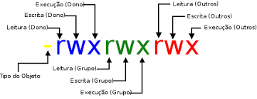

# Módulo 2: Trabalhando com usuários, arquivos e diretórios no Linux

## Manipulando Arquivos no Linux

### Terminal Linux

`usuario@servidor:~$`

- `$` - usuário com restrições
- `#` - superusuário
- `clear` ou `ctrl+l` - comando usado para limpa a tela no terminal

### Navegando pelo sistema de arquivos

- `pwd` - print working directory
- `cd` - change directory

```bash
cd caminho-desejado
```

**Opções:**

- `.` - indica o diretório atual
- `../` -  voltar um diretorio
- `/` - indica o diretorio raiz
- `~` - atalho para o diretório `/home/user`

**Caminho absoluto vs. Caminho relativo**

O caminho absoluto é quando é digitado todo o caminho do diretorio. Enquanto o caminho relativo é relativo ao atual diretório, ou seja, quando se está na `~`, por exemplo, e deseja ir para Documents tem duas opções: `cd ~/Documents` (absoluto) e `cd Documents` (relativo).

- `ls` - list
  - `ls | more` - alterar a exibiração, listando o conteúdo do diretório até o fim da página e para ser mais é preciso apertar `enter` afim de exibir um item e para sair da listagem basta digitar `q`.
  - `ls nome-do-arquivo` - o arquivo existir vai exibir
  - `ls p*` - lista os arquivos, diretórios e seus conteúdos que comecem com p.
  - `ls p?m` - lista os arquivos que comecem com p, tenha um letra qualquer no lutar da exclamação e termine com m.
  - `ls /diretorio` - lista o conteúdo do diretório (não precisa está no diretório em questão) e os filtros anteriores são aplicáveis também.
- `touch nome-do-arquivo` - comando usado para criar um arquivo.

### Localizando arquivos

- `find` - usando para fazer buscas.
  - `find -name "name"`

### Criando diretórios

- `mkdir nome-diretorio` - cria um diretório (não precisar está no diretório para criar, indicando a estrutura do diretório também funciona).

### Excluindo arquivos e diretórios

- `rmdir nome-diretorio` - apaga o diretório se ele estiver vazio e não é possível apagar um diretório se você está nele.
- `rm arquivo` - apaga arquivo.
  - `rm -rf diretorio` - usando esse comando é possível apagar um diretório mesmo não estando vazio. As opções significam r (recursivamente, ou seja, vai apagar o que estiver no diretório) e f (force)

### Obtendo ajuda

- `comando --help` - a maioria dos comandos possuem a opção help que uma documentação do comando.
- `man comando`
- `help comando` - equivale ao `-help`

### Executando tarefas administrativas como root

- `cat arquivo-de-texto` - usando para visualizar o conteúdo de uma arquivo.
- `sudo comando` - executa comando com permissão de root.

### Logando como usuário root

- `sudo passwd usuario` - o passwd atribuir uma senha para o usuário.
- `su` - logar no root.
- `su usario` - troca de usuario

### Liberando acesso remoto do usuário root

- `cat /etc/shh/sshd_congif` - visualiza as configurações do sshd.
- `nano /etc/shh/sshd_congif` - abre o arquivo usando o editor de texto nano e edita a linha `PermitRootLogin yes`
- `systemctl status sshd` - verifica o status do serviço.
- `systemctl restard sshd` - reseta o serviço

### Trabalhando com arquivos de texto

- `vi nome-arquivo` - se o arquivo existir vai abrir no editor de texto vi se não vai criar o arquivo e abrir.
- `nano arquivo` - idem

### Histórico de comandos

- `history` - exibe os histório de comandos utilizado por um usuário.
  - `history 10` - exibe os ultimos 10 comando
  - `!!` - executa o último comando
  - `!19` - executa o comando de numero 19 que está no histório
- `grep` - comando que faz uma filtragem
  - `history | grep "sudo"`
  
## Gerenciando Usuários no Linux

### Criando e excluindo usuários

Essas ações são administrativas, assim utiliza-se o root.

- `useradd login` - criar o usuario
  - `-m` - a opção cria a pasta do usuario no /home
  - `-c` - descrição do usuário (nome)
  - `-s` - define o shell
  - `-e` - tempo de acesso a conta (ex.: 22/10/2024)
  - `-p`

```bash
useradd joao -m -c "João Silva" -s /bin/bash 
```

- `userdel -f login` - remoção do usuário
  - `-f` - força a remoção
  - `-r` - romeve a pasta do usuario e configurações de email
- `passwd login` - cadastra e reseta a senha do usuario
  - `-e` - tempo de expiração da senha, se não colocar data ao realizar o login tem que redefinir a senha
- `chsh -s /bin/bash login` - change shell, comando usado para mudar ou definir o shell do usuário

### Editando informações do usuário

- `usermod login -opção` - editar as configurações do usuário
- `cat /etc/passwd` - informações sobre os usuários cadastrados
- `openssl passwd senha` - comando para incripitar a senha

### Shell Script - Criando usuários em lote

Criação de script é preciso criar um arquivo com a extensão `.sh` e o seguinte conteúdo para declarar que é um script:

```bash
#!/bin/bash
useradd usuario -c "usuário convidado" -m -p $(openssl passwd senha)

passwd usuario -e

```

### Adicionando usuários a grupos

Assim que um usuario é criado um grupo com mesmo nome também é criado.

Para visualizar os grupos do sistema usa o comando `cat /etc/group`

- `usermod -G nome-dos-grupos usuario` - adiciona em vários grupos de uma vez, além isso fazer uma edição, por exemplo, se o usuario está em 3 grupos e você roda o camando com apenas o grupo sudo ele vai sair dos outros grupos e vai ficar apenas em sudo.

### Criando novos grupos

- `groupadd nome` - cria grupo
- `groupdel nome` - deleta grupo se não tiver usuario
- `gpasswd -d usuario grupo` - vai remover o usuario do grupo

### Conhecendo o sistema de permissões



- `chown usuario:grupo /diretorio` - muda o dono e o grupo de um diretorio

### Alterando as permissões de um diretório - arquivo

| Ação         | Valor|
|--------------|------|
| Leitura (r)  | 4    |
| Escrita (w)  | 2    |
| Execução (x) | 1    |
| Nenhuma      | 0    |

- `chmod 750 diretorio` - alterando permissões
  - Dono tem permissão total (4+2+1)
  - Grupo tem permisão de leitura e execução (4+1)
  - Outros não tem permissão

## Materiais complementares

- [Curso de Linux Módulo Básico](https://www.linux.ime.usp.br/~albasalo/Apostila/apostila.pdf)
- [Mais informações sobre usuários no Linux:](https://www.infowester.com/usuarioslinux.php)
